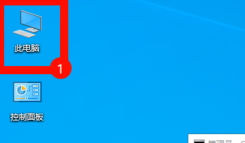
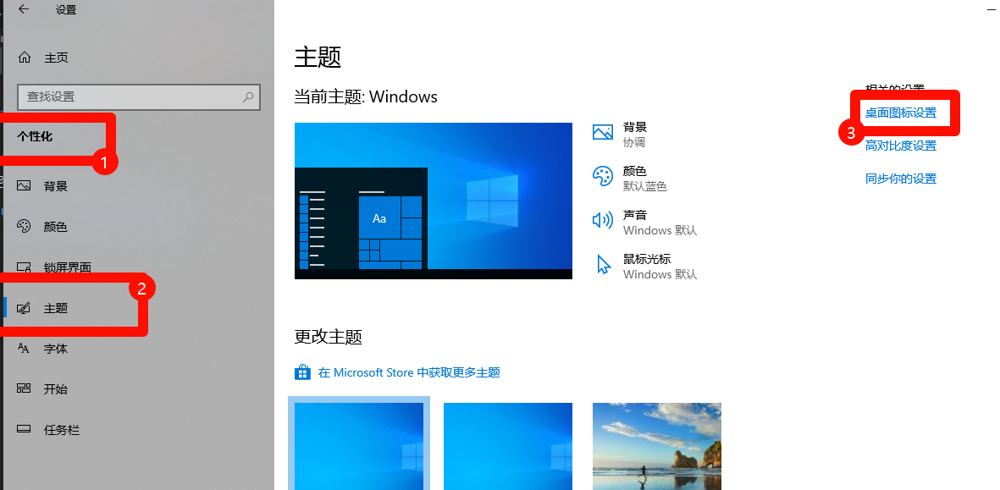
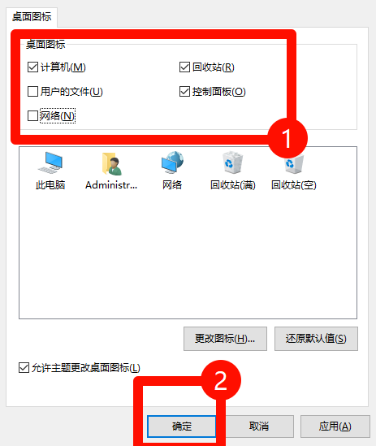
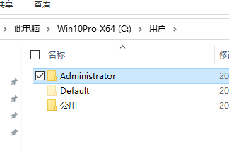

# 检查系统环境

###  为了确保你的电脑地区具有合适的开发环境

你需要先打开【此电脑】（或者直接按下 win + E ）

> ###  如果你的桌面没有【此电脑】 ，
> ###  
> ###  你需要先打开【设置】-> 【个性化】->【主题】

---

### 然后我们打开【此电脑】后

确保你的用户目录下（或者当前用户）没有使用中文用户名

如图所示就是，用户名为 `Administrator`

是 英文名字呢！

不是中文用户名就可以啦！！

中文用户名会导致很多问题！

> 如果你是中文用户名，那么建议你直接重装系统！
>
> 因为往往修改完用户名之后，会有很多东西都出问题的，很可怕的

---

然后，开发koishi，

### 请至少预留 1 GB+ 的存储空间

如果你的C盘已经红了，

那这边建议换个盘/扩盘/重装系统呢~

---

