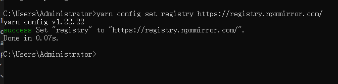

# nodejs 安装

## 全新环境的开发环境搭建

## 全新系统
?> **如果您的电脑是全新的虚拟机或是刚安装的系统，那请先检查修复下 DirectX图形api**

https://zhangyue667.lanzouh.com/DirectXRepairEnhanced

*可以点击此链接下载修复工具*


## 配置node.js

这个是node.js的 下载官网：https://nodejs.org/en


但是，如果你在国内，我们推荐使用 nodejs中文网下载nodejs：https://nodejs.cn/download/
（速度会更快）


打开应该是这样的


点击红框内的：
```
Windows 安装包
```
浏览器应该会自动下载`LTS版本安装包`（稳定版）

然后按照提示全部默认安装就可以了
> （如果你懒得看可以直接一路默认点击next）

<details>


<summary>
### 点击这里查看完整的安装截图
</summary>


</details>

<h6> 安装完成后可能会出现一些power shell的框


### 不用管它，给它运行着，我们可以一边等它运行 一边配置yarn

> 什么是yarn？为什么使用yarn？
>
> yarn 是一个类似npm的包管理器，功能很强大的包管理器。在开发koishi的时候，我们默认使用yarn
>
> （nodejs默认包管理器为npm）

---

## 配置yarn

### 在安装nodejs完成后，

由于网络问题，在国内的我们还需要配置包管理器对应的 `镜像源`

> （相当于是上面使用nodejs中文网的作用）

---

首先为了操作配置，我们需要先开一个`终端`

按下 `  win + R  `，然后我们输入` cmd `，并且回车


然后我们输入（ # 表示注释 ）
```
# 设置为淘宝镜像源
npm config set registry https://registry.npmmirror.com/
```


完成后不要关闭黑框框，继续下面的步骤

---

### 然后，我们要安装 yarn

然后我们输入（ # 表示注释 ）

```
# 全局安装yarn
npm install -g yarn
```


由于网络问题，在国内的我们还需要配置包管理器对应的 `镜像源`

我们输入（ # 表示注释 ）
```
# 设置为淘宝镜像源
yarn config set registry https://registry.npmmirror.com/
```


---

### 这样就安装完了必要的包管理器

为了测试他们的可用性，我们需要测试一下是否可用。


在以上代码运行完毕后检查一下：

你可以在终端依次输入

```
node -v
```

```
npm -v
```

```
yarn -v
```

> 如果报错则是因为没有使用管理员启动
>
> 你需要在按下win + R 之后输入powershell
>
> 输入 set-ExecutionPolicy RemoteSigned
> 
```
PS C:\Users\Administrator> set-ExecutionPolicy RemoteSigned

执行策略更改
执行策略可帮助你防止执行不信任的脚本。更改执行策略可能会产生安全风险，如 https:/go.microsoft.com/fwlink/?LinkID=135170
中的 about_Execution_Policies 帮助主题所述。是否要更改执行策略?
[Y] 是(Y)  [A] 全是(A)  [N] 否(N)  [L] 全否(L)  [S] 暂停(S)  [?] 帮助 (默认值为“N”): Y
PS C:\Users\Administrator>
```
> 在此之后你再执行上述的yarn安装步骤

### 预期输出应该类似于：

```
C:\Users\Administrator>npm -v
10.8.2

C:\Users\Administrator>yarn -v
1.22.22

C:\Users\Administrator>node -v
v20.18.0

C:\Users\Administrator>
```


如果能成功打印版本号就没有问题啦~
