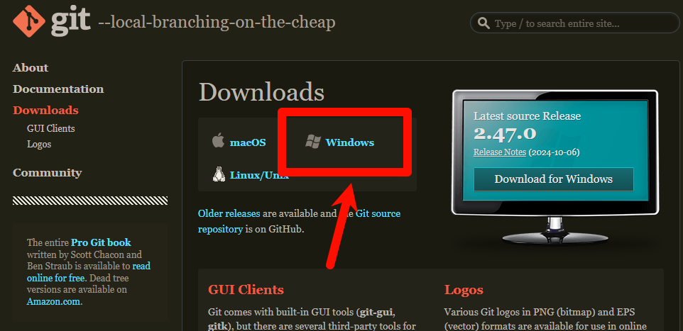
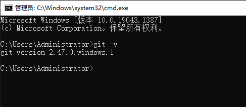

# git 安装

## 为什么要安装git

在koishi项目模板中，我们会有些与他人共同开发的需求

但是为了帮助别人写代码，一起共同开发，我们就需要使用git来帮助我们拉取仓库...等


---


## 下载安装包

前往 git 官方发布页：  https://git-scm.com/downloads




---


等待下载完整后，一路 next 确认安装！

即可安装完成！

###  注意安装时一路next会在安装完成后自动打开一个网页
###  不用管，直接关掉即可

然后我们需要打开一个终端，验证安装

按下 `  win + R  `，然后我们输入` cmd `，并且回车

你可以在终端依次输入

```
git -v
```



---

有正确的版本输出就可以了。


---


## 如果安装失败了，那你可以试试重装git？

---
