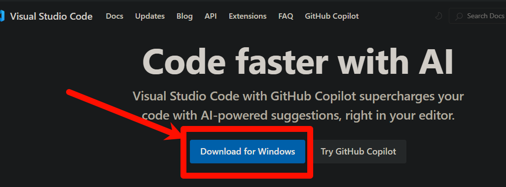
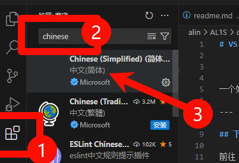
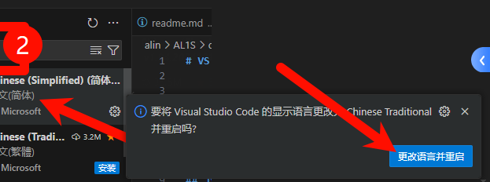

# VS code 安装教程


一个好的编辑器可以让你的开发效率更高。

---

## 下载

前往 vsc 官方网站 https://code.visualstudio.com/



---

点击这个按钮后，会自动开始下载安装包了！


然后下载好了，运行安装包


按照安装包提示，完成安装即可

---


## 更换语言

首次接触到VSC，你可能不适应使用英文界面

你可以在【商店】里搜索

```
chinese
```


安装这个插件扩展！

然后过一会就会在编辑器右下角出现提示【是否重启】

我们选择【yes】




---


到这里就安装完成了

