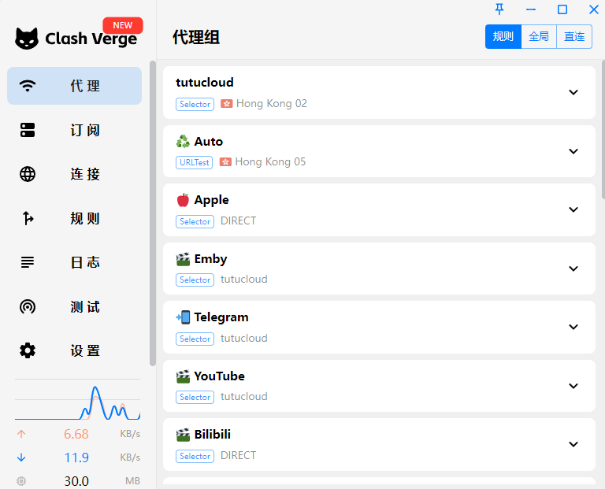
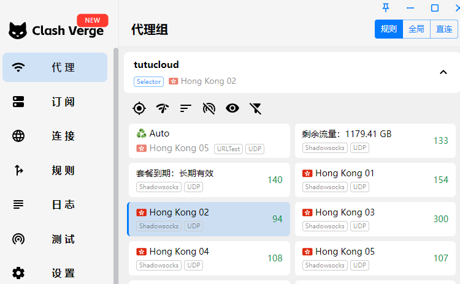
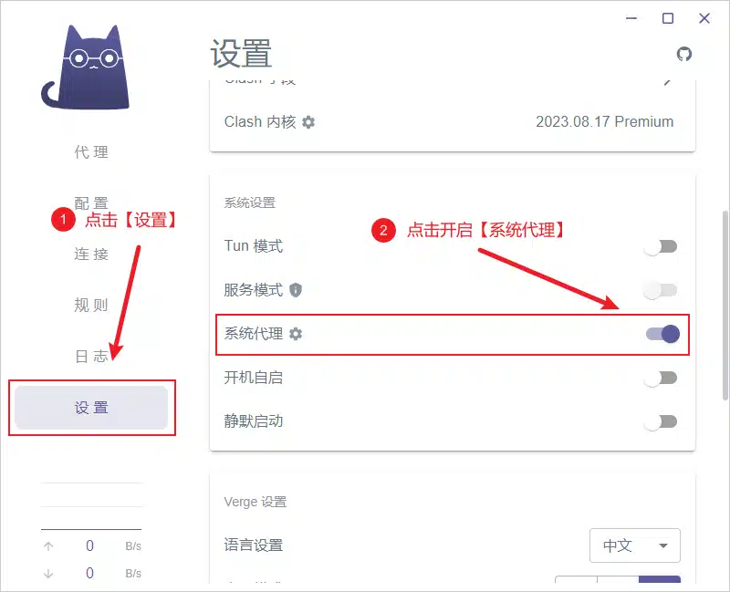

# clash 安装

啊哈哈，这个原因，也不必多说

国内的网络的确不怎么好呢~

---

「Windows电脑」clash客户端

安装教程

1：先下载clash电脑版本

这里可以下载

https://share.feijipan.com/s/b9CvvknZ?code=1234

2：下载安装完后咱们【导入】一下【订阅链接】

可以使用免费的
https://mirror.ghproxy.com/https://raw.githubusercontent.com/ripaojiedian/freenode/main/clash

3：导入订阅后咱们可以选择节点(如果没有看到下面的节点，可以重启一下clash就可以了。)

4：选择节点后去设置里面按照图上所示开启系统代理即可

注意事项：

打开系统代理仍然无法访问外网时请尝试安装并打开服务模式，随后打开tun模式

==========================================

免费的不好用的话，可以找一些付费的用，

这个还算可以，买不限时，限量的套餐即可了

> 比如 60 GB 流量，不限使用时间，对于偶尔网上冲浪的咱很足够了米

https://0000dqwd-hjkgk.tutucloud.shop/#/dashboard