# 搭建 koishi 项目模板

在前面的步骤里，你已经安装了nodejs

并且为一些包管理器设置了国内镜像

---

现在你可以找一个文件夹，然后把这个文件夹当成koishi的安装文件夹啦~

然后我们在【资源管理器】的地址栏里输入` cmd `并且回车

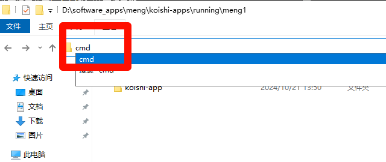

---


## 在弹出的命令提示符里输入

```
yarn create koishi
```
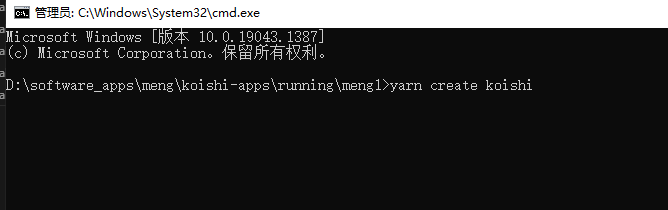

---


## 然后一路回车！，一直回车，直到打开网页koishi

---

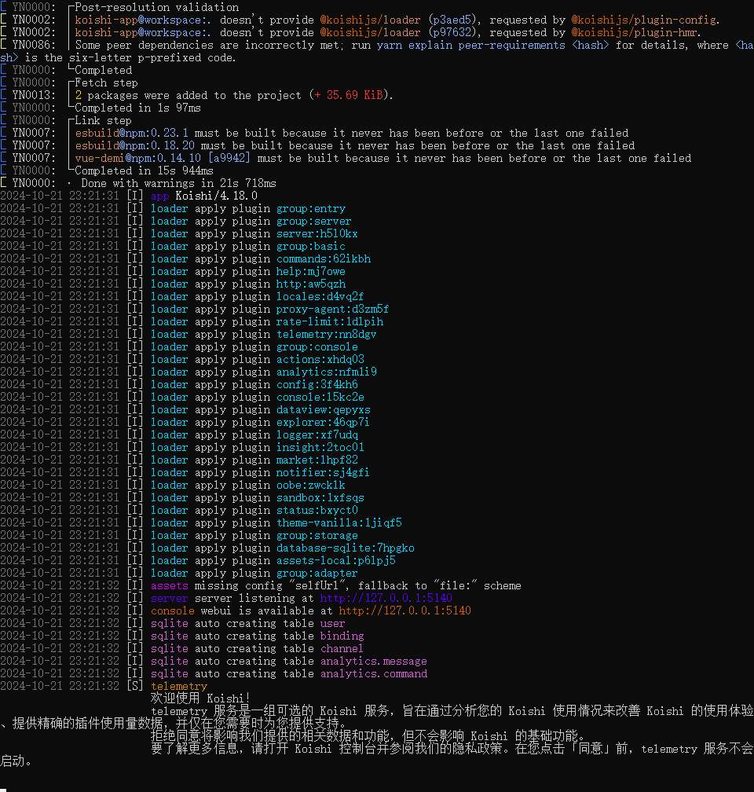

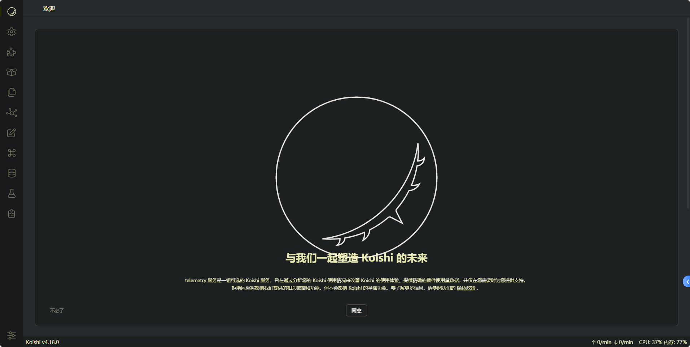

---


到这里，项目模板就是新建好了！

---


## 如何开发

我们先在终端按下`Ctrl + C `以退出运行程序

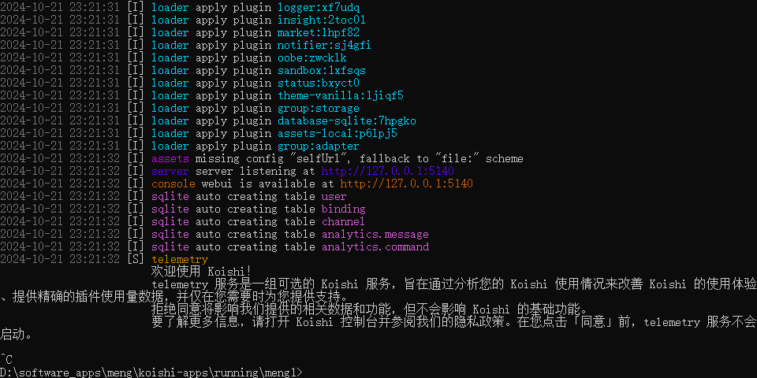

然后可以关掉这个终端了（点右上角的叉叉）

我们找到koishi的【应用目录】

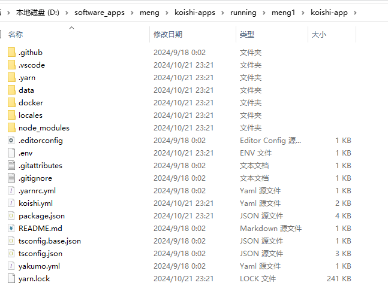

就是长这个样子的

我们需要在这里新开一个终端

在【资源管理器】的地址栏里输入` cmd `并且回车


---


## 创建新插件

在【应用目录】运行下面的命令以创建一个新的【插件工作区】：
```
yarn setup [name] [-c] [-m] [-G]
```
- name: 插件的包名，缺省时将进行提问
- -c, --console: 创建一个带控制台扩展的插件
- -m, --monorepo: 创建 monorepo 的插件
- -G, --no-git: 跳过 git 初始化


我们假设你执行的是`yarn setup example`
```
yarn setup example
```
> 插件的 description 可以先回车，留空。

### 我们假设你创建了一个叫 example 的插件，

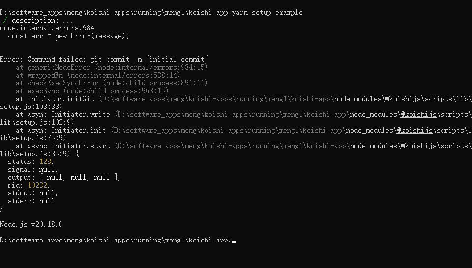

> 图中的报错不需要管，继续往下

那么，你将看到下面的目录结构：

```
root
├── external
│   └── example
│       ├── src
│       │   └── index.ts
│       └── package.json
├── koishi.yml
└── package.json
```

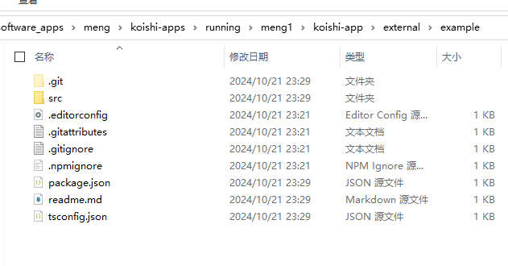

---

打开 `koishi-app\external\example\src\index.ts` 文件，并修改其中的代码：

```ts
import { Context } from 'koishi'

export const name = 'example'

export function apply(ctx: Context) {
  // 如果收到“天王盖地虎”，就回应“宝塔镇河妖”
  ctx.on('message', (session) => {
    if (session.content === '天王盖地虎') {
      session.send('宝塔镇河妖')
    }
  })
}
```

然后按下`ctrl + S`保存该文件

# 以 开发模式 重新运行你的项目

回到koishi的【应用目录】目录下的命令提示符里

我们在此处依次执行
```
yarn
```

```
yarn dev
```

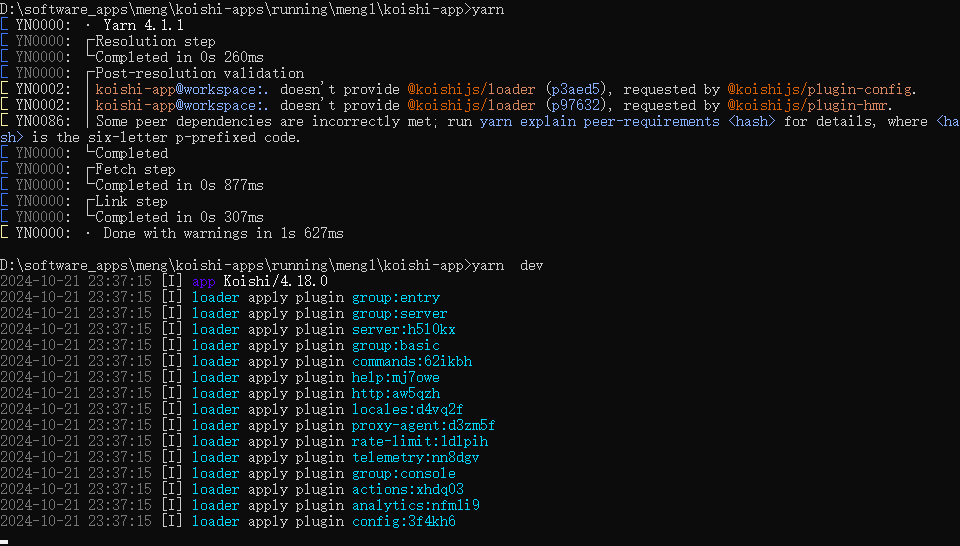

---

# 添加插件

在koishi【全局设置】点击右上角的「添加插件」按钮

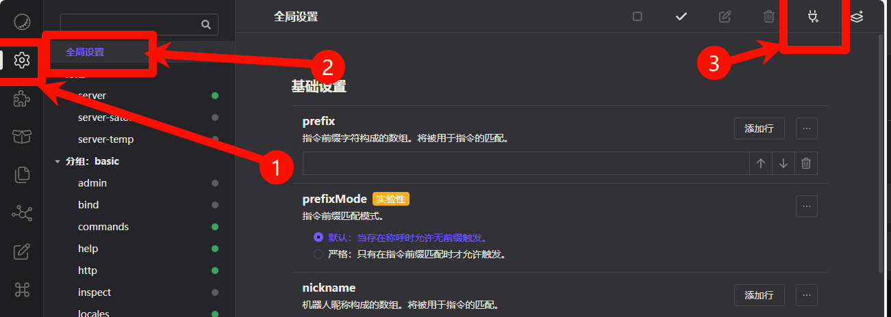

# 选择你刚才创建的插件名称

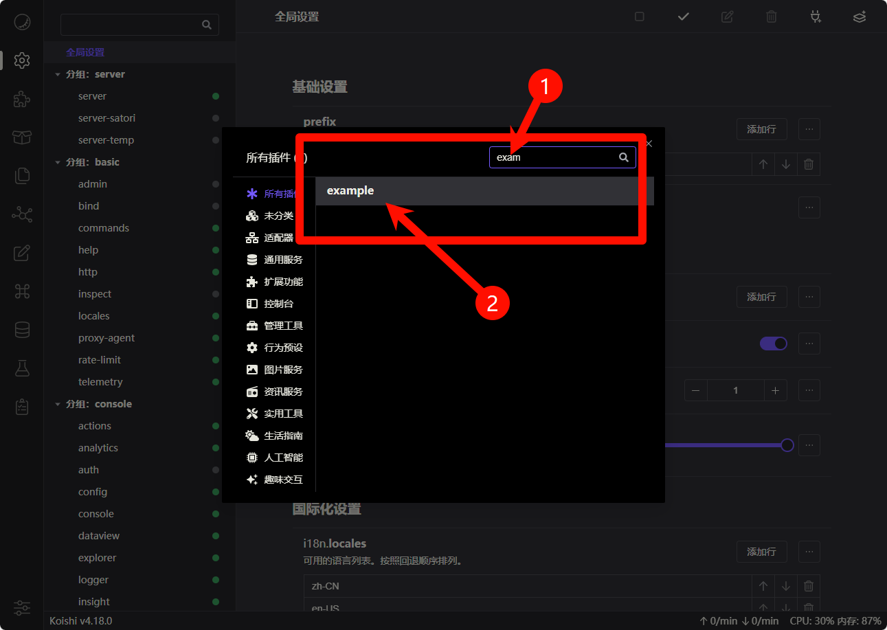


你会立即在网页控制台的配置界面中看到 example 插件

# 点击启用


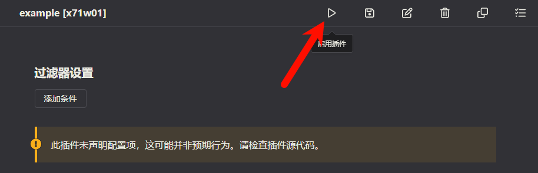


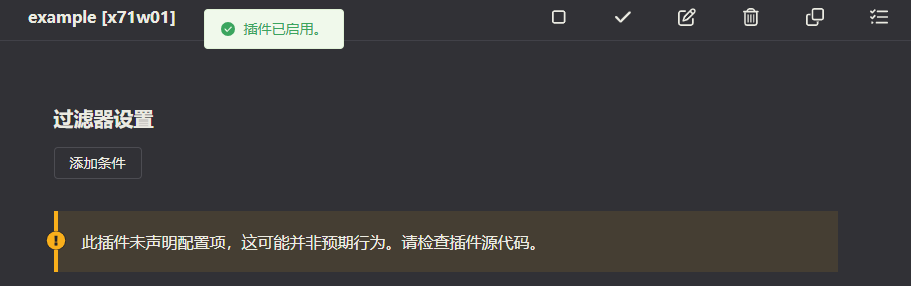

---


# 与机器人对话

在沙盒里，我们可以对机器人进行一些功能测试。

点击【沙盒】->【添加用户】->【输入：天王盖地虎】

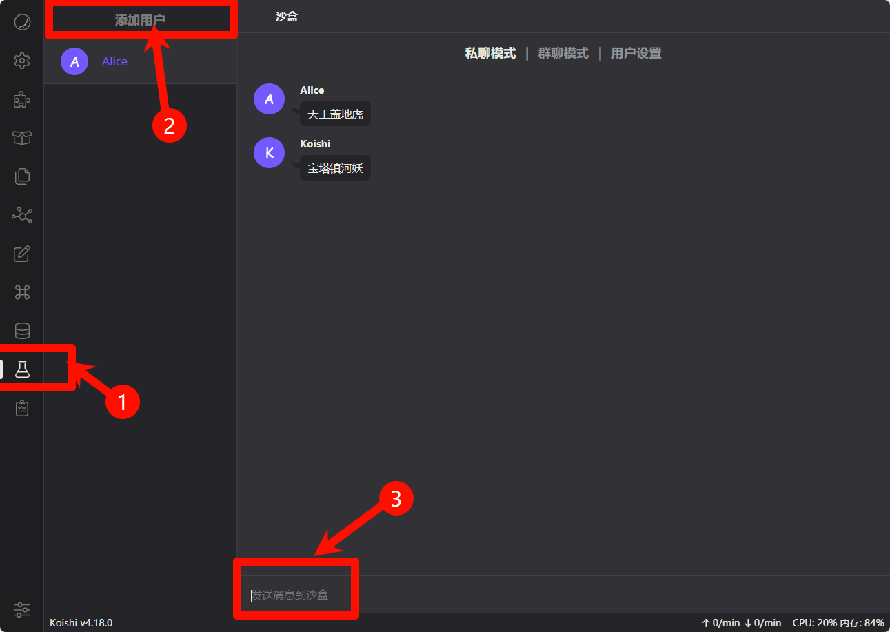

如图这样得到了【koishi】的回复，说明你的功能就正常了！


---

# 构建源代码

上面的插件暂时还只能在开发模式下运行。

想要在生产模式下使用或发布到插件市场，你需要构建你的源代码

> 由于我们写的是ts，
>
>所以我们需要编译成js才能发布插件给别人用哦~~

---

在【应用目录】运行下面的命令：
```
yarn build [...name]
```
- name: 要构建的插件列表，缺省时表示全部插件（可以不写）


还是以上面的插件 example 为例：

- 后端代码将输出到 `external/example/lib` 目录
- 前端代码将输出到 `external/example/dist` 目录 (如果存在)

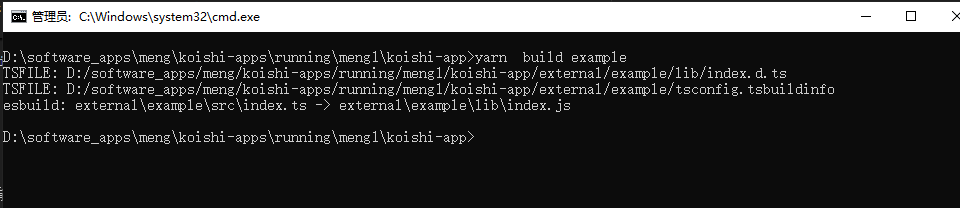
```
D:\software_apps\meng\koishi-apps\running\meng1\koishi-app>yarn  build example
TSFILE: D:/software_apps/meng/koishi-apps/running/meng1/koishi-app/external/example/lib/index.d.ts
TSFILE: D:/software_apps/meng/koishi-apps/running/meng1/koishi-app/external/example/tsconfig.tsbuildinfo
esbuild: external\example\src\index.ts -> external\example\lib\index.js

D:\software_apps\meng\koishi-apps\running\meng1\koishi-app>
```
这样就是代表编译成功了！没有报错哦！

---

然后，你可以发布插件啦！

---


# 发布插件

这里的发布教程，请查看：

### https://koishi.chat/zh-CN/guide/develop/publish.html

---

