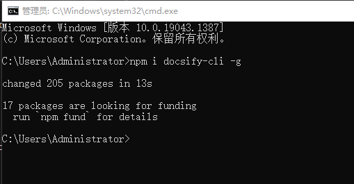
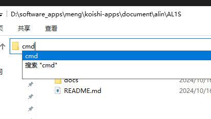
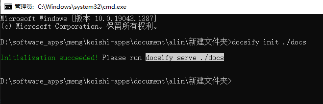
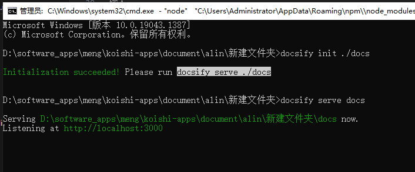
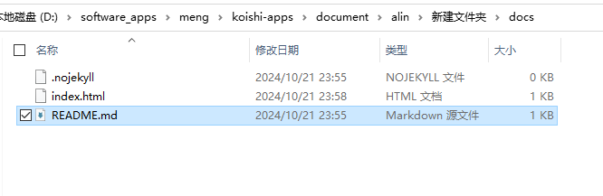

# docsify

官方文档请查看

https://docsify.js.org/#/quickstart

---


我们先按`win + R`输入`cmd`回车

输入

```
npm i docsify-cli -g
```
回车



---

然后找个你希望写文档的文件夹

在【资源管理器】里输入`cmd`回车



输入

```
docsify init ./docs
```
回车



---

然后我们需要运行这个项目


输入

```
docsify serve docs
```
回车


### 出现类似 http://localhost:3000 的样子 即为运行成功
---

我们需要编辑 `\docs\README.md`




这个就是默认的，打开这个网址之后的出现的第一个页面。


---


