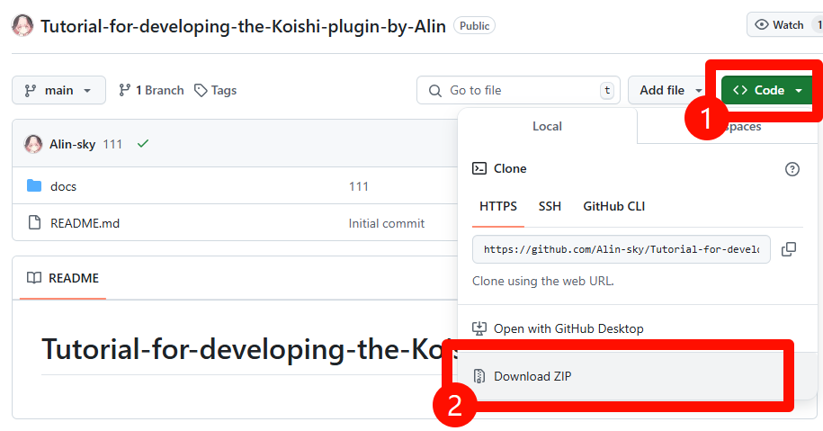

# docsify

官方文档请查看

https://docsify.js.org/#/quickstart

---


我们先按`win + R`输入`cmd`回车

输入

```
npm i docsify-cli -g
```
回车


---

### 然后请前往
### https://github.com/Alin-sky/Tutorial-for-developing-the-Koishi-plugin-by-Alin



---
## 解压后得到


---

然后我们需要运行这个项目

在上图这个文件夹的位置，开一个终端


输入

```
docsify serve docs
```
回车


### 出现类似 http://localhost:3000 的样子 即为运行成功
---

然后编辑你需要修改的内容。

---

## 提PR

## fork 原项目


## 提交修改到你的项目


## 创建PR


